## 🏗️ Architecture Overview

SemantiClip leverages the **Semantic Kernel Process Framework** to orchestrate multiple AI agents in a coordinated workflow:

```mermaid
graph TD
    A[Video Input] --> B[PrepareVideoStep]
    B --> C[TranscribeVideoStep]
    C --> D[GenerateBlogPostStep]
    D --> E[EvaluateBlogPostStep]
    E --> F[PublishBlogPostStep]
    
    B --> B1[FFmpeg Audio Extraction]
    C --> C1[Azure OpenAI Whisper]
    D --> D1[Local SLM via Ollama]
    E --> E1[Azure AI Agent]
    F --> F1[GitHub MCP Server]
    
    D --> G[📄 Markdown File Saved]
    F --> H[📝 Published to GitHub]
    
    style A fill:#e1f5fe
    style G fill:#c8e6c9
    style H fill:#c8e6c9
    style D1 fill:#fff3e0
    style C1 fill:#e8f5e8
    style E1 fill:#f3e5f5
    style F1 fill:#fff8e1
```



## 🤖 AI Agent Orchestration

### Semantic Kernel Process Framework
SemantiClip uses the **Semantic Kernel Process Framework** to create a sophisticated multi-step AI workflow:

- **Process Builder**: Constructs the video processing workflow with multiple interconnected steps
- **Event-Driven Architecture**: Each step emits events that trigger the next step in the pipeline
- **State Management**: Maintains processing state across the entire workflow
- **Error Handling**: Robust error handling and recovery mechanisms

### AI Agents & Models Used

| Step | AI Technology | Purpose |
|------|---------------|---------|
| **PrepareVideoStep** | FFmpeg | Audio extraction from video files |
| **TranscribeVideoStep** | Azure OpenAI Whisper | Speech-to-text transcription |
| **GenerateBlogPostStep** | Local SLM (Ollama) | Blog post generation from transcript |
| **EvaluateBlogPostStep** | Azure AI Agent | Quality evaluation and refinement |
| **PublishBlogPostStep** | GitHub MCP Server | Automated publishing to GitHub |

## 🔄 High-Level Processing Flow


## 📁 Project Structure

```
SemantiClip/
├── SemanticClip.API/           # Web API endpoints
├── SemanticClip.Client/        # Blazor WebAssembly UI
├── SemanticClip.Console/       # Console application
├── SemanticClip.Core/          # Domain models and interfaces
│   ├── Interfaces/            # Service interfaces
│   └── Models/               # Data models
└── SemanticClip.Services/     # Business logic and AI orchestration
    ├── Services/             # Main processing services
    ├── Steps/               # Semantic Kernel process steps
    ├── Plugins/            # AI agent plugins
    └── Utilities/          # Configuration and helpers
```

## 🛠️ Built With

### Core Technologies
- [.NET 9](https://dotnet.microsoft.com/) - Modern cross-platform framework
- [Microsoft Semantic Kernel](https://learn.microsoft.com/en-us/semantic-kernel/) - AI orchestration framework
- [Semantic Kernel Process Framework](https://learn.microsoft.com/en-us/semantic-kernel/frameworks/process/process-framework) - Workflow orchestration
- [Semantic Kernel Agent Framework](https://learn.microsoft.com/en-us/semantic-kernel/frameworks/agent/?pivots=programming-language-csharp) - AI agent coordination

### AI Services
- [Azure OpenAI](https://azure.microsoft.com/en-us/products/cognitive-services/openai-service) - Whisper transcription & GPT models
- [Ollama](https://ollama.ai/) - Local SLM execution (phi4-mini)
- [Azure AI Agent](https://learn.microsoft.com/en-us/azure/ai-services/) - Advanced AI capabilities

### Integration
- [FFmpeg](https://ffmpeg.org/) - Media processing
- [ModelContextProtocol](https://github.com/microsoft/ModelContextProtocol) - GitHub integration

*SemantiClip showcases the power of Microsoft Semantic Kernel's Process and Agent Frameworks for building sophisticated AI-driven applications with multiple coordinated agents.*