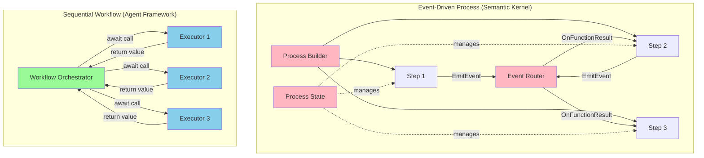
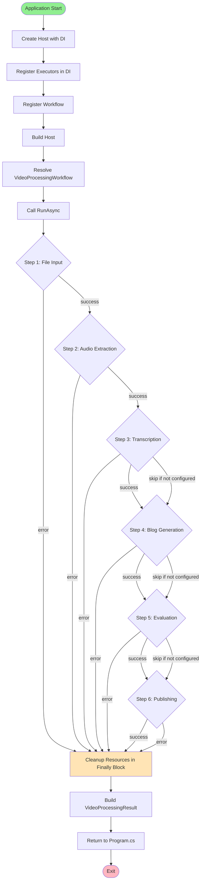
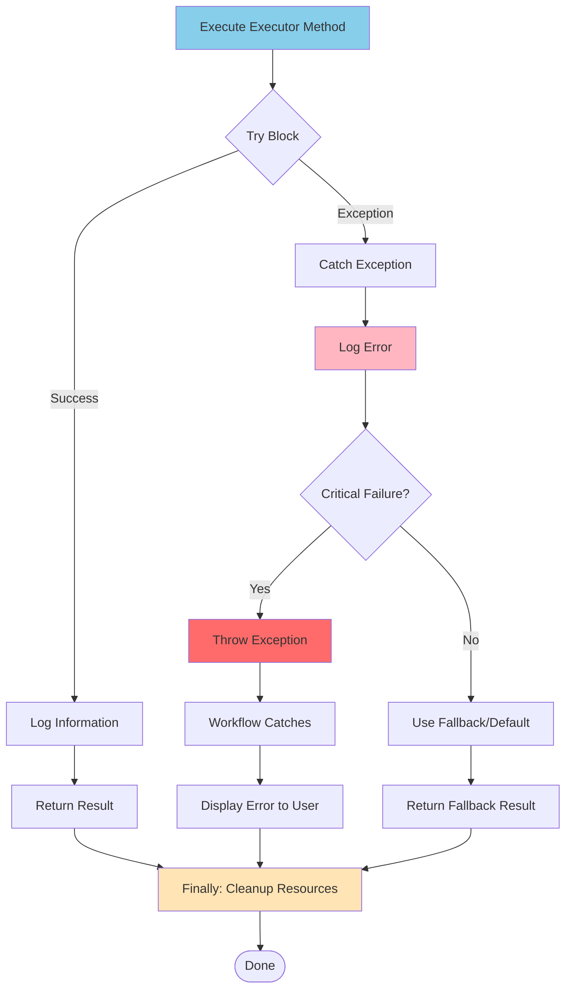
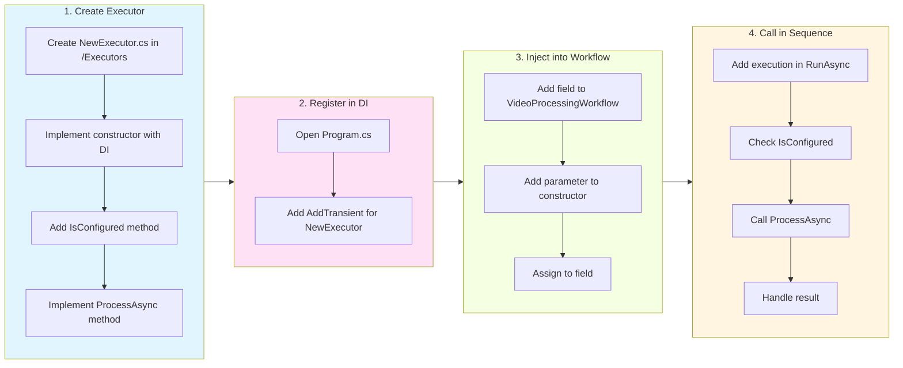

# Workflow Architecture & Orchestration

This document explains the **workflow orchestration pattern** used in SemanticClip.Agents and how it differs from traditional process frameworks.

## 🎯 Core Concepts

### Executors

**Executors** are independent, single-responsibility units that perform a specific task in the workflow. Think of them as specialized workers, each with one job.

**Key Characteristics:**
- **Stateless**: No shared state between executions
- **Self-contained**: All dependencies injected via constructor
- **Validatable**: `IsConfigured()` checks if executor can run
- **Async**: All operations are async for scalability
- **Error-aware**: Handles exceptions gracefully with logging

**Executor Example:**
```csharp
public class TranscriptionExecutor
{
    private readonly ILogger<TranscriptionExecutor> _logger;
    private readonly IConfiguration _configuration;
    private readonly AzureOpenAIClient? _openAIClient;

    // Constructor injection
    public TranscriptionExecutor(ILogger<TranscriptionExecutor> logger, IConfiguration configuration)
    {
        _logger = logger;
        _configuration = configuration;
        // Initialize Azure OpenAI client
    }

    // Validation
    public bool IsConfigured() => _openAIClient != null;

    // Single responsibility: transcribe audio
    public async Task<string> TranscribeAudioAsync(string audioPath)
    {
        // Transcription logic
    }
}
```

### Workflow Orchestrator

The **Workflow Orchestrator** (`VideoProcessingWorkflow`) coordinates executors, managing the data flow and execution sequence.

**Responsibilities:**
- **Sequence Control**: Determine order of executor invocations
- **Data Flow**: Pass outputs from one executor as inputs to the next
- **Error Handling**: Catch and report failures
- **State Management**: Track results from each step
- **Resource Cleanup**: Ensure temporary resources are released

**Orchestration Pattern:**
```csharp
public class VideoProcessingWorkflow
{
    // Executors injected via DI
    private readonly FileInputExecutor _fileInputExecutor;
    private readonly AudioExtractionExecutor _audioExtractionExecutor;
    private readonly TranscriptionExecutor _transcriptionExecutor;
    // ... more executors

    public async Task<VideoProcessingResult> RunAsync()
    {
        // Step 1: Input
        var videoPath = await _fileInputExecutor.GetVideoFilePathAsync();
        
        // Step 2: Transform - output of step 1 becomes input of step 2
        var audioPath = await _audioExtractionExecutor.ExtractAudioAsync(videoPath);
        
        // Step 3: Process - conditional execution
        if (_transcriptionExecutor.IsConfigured())
            var transcript = await _transcriptionExecutor.TranscribeAudioAsync(audioPath);
        
        // ... continue chain
    }
}
```

## 🔗 Edges (Data Flow)

**Edges** represent the connections between executors - how data flows from one step to the next.

### In Traditional Process Frameworks
Edges are **explicit** event-based connections:
```csharp
// Semantic Kernel Process Framework
transcribeStep
    .OnFunctionResult()  // Event triggered
    .SendEventTo(generateStep, parameterName: "transcript");  // Explicit edge
```

### In Agent Framework Pattern
Edges are **implicit** through direct method calls and return values:
```csharp
// Microsoft Agent Framework Pattern
var transcript = await _transcriptionExecutor.TranscribeAudioAsync(audioPath);
var blogPost = await _blogGenerationExecutor.GenerateBlogPostAsync(transcript, videoPath);
//            ↑ implicit edge: transcript flows from transcription to generation
```

## 📊 Workflow Visualization

### SemanticClip.Agents Workflow Graph


### Detailed Flow Diagram


### Executor Dependency Graph


### State Flow Diagram


```

### Data Types at Each Edge

| Edge | Source Executor | Target Executor | Data Type | Description |
|------|----------------|----------------|-----------|-------------|
| 1 | FileInput | AudioExtraction | `string` | Absolute path to MP4 file |
| 2 | AudioExtraction | Transcription | `string` | Path to extracted WAV file |
| 3 | Transcription | BlogGeneration | `string` | Full transcript text |
| 4 | BlogGeneration | BlogEvaluation | `string` | Initial blog post markdown |
| 5 | BlogEvaluation | BlogPublishing | `string` | Improved blog post markdown |
| 6 | BlogPublishing | Result | `BlogPublishingResponse` | URL + status |

## 🆚 Comparison: Process vs Workflow Orchestration

### Architecture Comparison Diagram



### Event-Driven Process (Semantic Kernel)

**Structure:**
```
Process Builder
├── Define Steps
├── Wire Events (create edges)
├── Configure Routing
└── Execute Process
    ├── Step emits event
    ├── Event router finds target
    ├── Target step receives event
    └── Repeat
```

**Pros:**
- Supports complex branching and parallel execution
- Dynamic workflow modification at runtime
- Decoupled steps (don't know about each other)
- Built-in state management

**Cons:**
- Higher complexity
- Harder to debug (trace events)
- More boilerplate code
- Steeper learning curve

### Sequential Workflow (Agent Framework)

**Structure:**
```
Workflow Orchestrator
├── Inject Executors
└── Execute Sequence
    ├── Call executor method
    ├── Get result
    ├── Pass to next executor
    └── Repeat
```

**Pros:**
- Simple and intuitive
- Easy to debug (step through code)
- Minimal boilerplate
- Clear data flow

**Cons:**
- Limited to sequential or simple branching
- Manual state management
- Harder to parallelize
- Tight coupling in orchestrator

## 🎨 Execution Patterns

### 1. Sequential Execution
```csharp
var result1 = await _executor1.RunAsync(input);
var result2 = await _executor2.RunAsync(result1);
var result3 = await _executor3.RunAsync(result2);
```

### 2. Conditional Execution
```csharp
var result1 = await _executor1.RunAsync(input);

if (result1.RequiresProcessing)
    var result2 = await _executor2.RunAsync(result1);
else
    var result2 = await _executor3.RunAsync(result1);
```

### 3. Optional Steps
```csharp
var result1 = await _executor1.RunAsync(input);

// Skip if not configured
if (_executor2.IsConfigured())
    var result2 = await _executor2.RunAsync(result1);
```

### 4. Error Handling with Fallback
```csharp
var result1 = await _executor1.RunAsync(input);

try 
{
    var result2 = await _executor2.RunAsync(result1);
}
catch (Exception ex)
{
    _logger.LogWarning("Step 2 failed, using fallback");
    var result2 = FallbackResult;
}
```

### 5. Parallel Execution (Advanced)
```csharp
var result1 = await _executor1.RunAsync(input);

// Fork: run two executors in parallel
var task2 = _executor2.RunAsync(result1);
var task3 = _executor3.RunAsync(result1);
await Task.WhenAll(task2, task3);

// Join: combine results
var result4 = await _executor4.RunAsync(task2.Result, task3.Result);
```

## 🔧 Implementation Details

### Executor Lifecycle Diagram


### Workflow Lifecycle

```
Constructor
    ↓
Register in DI (Program.cs)
    ↓
Injected into Workflow
    ↓
IsConfigured() check
    ↓
Execute method called
    ↓
Return result
    ↓
Dispose (if IDisposable)
### Workflow Lifecycle Diagram



### Error Handling Flow



```

## 📋 Best Practices

### For Executors

1. **Single Responsibility**: One executor = one task
2. **Configuration Validation**: Always implement `IsConfigured()`
3. **Error Messages**: Provide clear, actionable error messages
4. **Logging**: Log at appropriate levels (Debug, Info, Warning, Error)
5. **Resource Cleanup**: Dispose of resources properly
6. **Async All the Way**: Use async/await consistently
7. **Avoid Side Effects**: Don't modify external state

### For Workflows

1. **Linear When Possible**: Keep workflows sequential for simplicity
2. **Validate Early**: Check executor configuration before execution
3. **Handle Errors Gracefully**: Don't let one failure crash the workflow
4. **Track State**: Capture results from each step
5. **Clean Up**: Use try-finally for resource cleanup
6. **Progress Reporting**: Inform users of current step
7. **Result Completeness**: Return all relevant data in result object

## 🚀 Extending the Workflow

### Adding a New Executor - Process Diagram



### Workflow Modification Patterns


### Adding a New Executor

1. **Create the executor class** in `/Executors`:
```csharp
public class NewExecutor
{
    public async Task<OutputType> ProcessAsync(InputType input)
    {
        // Implementation
    }
}
```

2. **Register in DI** in `Program.cs`:
```csharp
builder.Services.AddTransient<NewExecutor>();
```

3. **Inject into workflow**:
```csharp
public VideoProcessingWorkflow(
    // ... existing executors
    NewExecutor newExecutor)
{
    _newExecutor = newExecutor;
}
```

4. **Call in sequence**:
```csharp
var newResult = await _newExecutor.ProcessAsync(previousResult);
```

### Modifying Workflow Flow

**Insert a step:**
```csharp
var result1 = await _executor1.RunAsync(input);
var result2 = await _newExecutor.RunAsync(result1);  // New step
var result3 = await _executor3.RunAsync(result2);
```

**Make a step optional:**
```csharp
var result2 = result1;  // Default to previous result
if (_optionalExecutor.IsConfigured())
    result2 = await _optionalExecutor.RunAsync(result1);
```

**Add branching:**
```csharp
if (result1.NeedsPathA)
    var result2 = await _executorA.RunAsync(result1);
else
    var result2 = await _executorB.RunAsync(result1);
```

## 🎓 Summary

**Executors** are the workers - specialized, independent units that do one thing well.

**Edges** are the connections - data flowing from one executor to the next (implicit via method parameters and return values).

**Workflows** are the managers - coordinating executors in the right sequence with proper error handling and cleanup.

This pattern provides a **simple, debuggable, and maintainable** approach to workflow orchestration, ideal for sequential AI processing pipelines like video-to-blog transformation.
