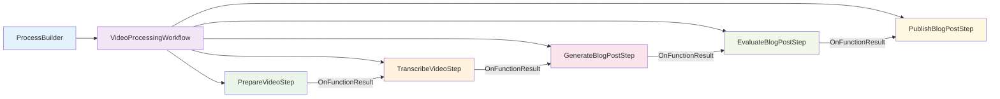
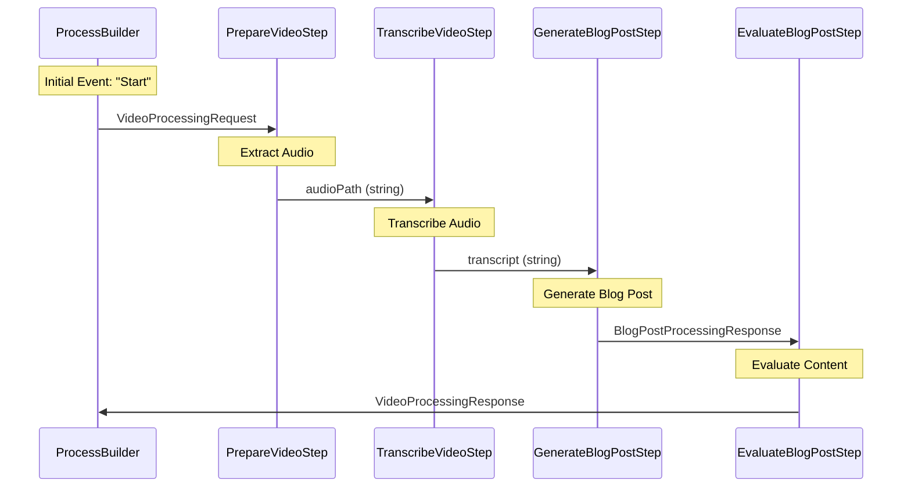

# Semantic Kernel Process Framework in SemantiClip

## Overview

The **Semantic Kernel Process Framework** is a powerful orchestration engine that enables the creation of complex, multi-step AI workflows. SemantiClip leverages this framework to coordinate multiple AI agents in a sophisticated video processing pipeline, demonstrating advanced patterns for AI orchestration and state management.

## What is the Process Framework?

The Semantic Kernel Process Framework provides:

- **Workflow Orchestration**: Define complex multi-step processes with dependencies
- **Event-Driven Architecture**: Steps communicate through events and state transitions
- **State Management**: Automatic persistence and retrieval of process state
- **Error Handling**: Built-in mechanisms for handling failures and retries
- **Parallel Execution**: Support for concurrent step execution where possible
- **Dynamic Workflows**: Runtime modification of process flows based on conditions

## Core Concepts

### 1. Process Steps (`KernelProcessStep`)
Individual units of work that perform specific tasks within the workflow.

### 2. Process Builder (`ProcessBuilder`)
Constructs the workflow by defining steps and their relationships.

### 3. Events (`KernelProcessEvent`)
Messages that flow between steps to trigger actions and pass data.

### 4. State Management
Automatic persistence of step states and process context.

### 5. Function Targets
Define how steps connect and which functions are called.

## SemantiClip's Process Implementation

### Architecture Overview



### Process Definition in VideoProcessingService

```csharp
public async Task<VideoProcessingResponse> ProcessVideoAsync(VideoProcessingRequest request)
{
    // 1. Create Process Builder
    ProcessBuilder processBuilder = new("VideoProcessingWorkflow");
    
    // 2. Add Processing Steps
    var prepareVideoStep = processBuilder.AddStepFromType<PrepareVideoStep>();
    var transcribeVideoStep = processBuilder.AddStepFromType<TranscribeVideoStep>();
    var generateBlogPostStep = processBuilder.AddStepFromType<GenerateBlogPostStep>();
    var evaluateBlogPostStep = processBuilder.AddStepFromType<EvaluateBlogPostStep>();
    
    // 3. Orchestrate the Process Flow
    processBuilder
        .OnInputEvent("Start")
        .SendEventTo(new(prepareVideoStep, 
            functionName: PrepareVideoStep.Functions.PrepareVideo,
            parameterName: "request"));

    prepareVideoStep
        .OnFunctionResult()
        .SendEventTo(new ProcessFunctionTargetBuilder(transcribeVideoStep,
            functionName: TranscribeVideoStep.Functions.TranscribeVideo,
            parameterName: "videoPath"));

    transcribeVideoStep
        .OnFunctionResult()
        .SendEventTo(new ProcessFunctionTargetBuilder(generateBlogPostStep,
            functionName: GenerateBlogPostStep.Functions.GenerateBlogPost,
            parameterName: "transcript"));

    generateBlogPostStep
        .OnFunctionResult()
        .SendEventTo(new ProcessFunctionTargetBuilder(evaluateBlogPostStep,
            functionName: EvaluateBlogPostStep.Functions.EvaluateBlogPost,
            parameterName: "blogstate"));
    
    // 4. Build and Execute
    var process = processBuilder.Build();
    var initialResult = await process.StartAsync(_kernel, 
        new KernelProcessEvent { Id = "Start", Data = request });
    
    // 5. Retrieve Final State
    var finalState = await initialResult.GetStateAsync();
    var finalCompletion = finalState.ToProcessStateMetadata();
    
    return (VideoProcessingResponse)finalCompletion.StepsState!["EvaluateBlogPostStep"].State;
}
```

## Step Implementation Patterns

### 1. KernelProcessStep Base Class

All processing steps inherit from `KernelProcessStep<T>` where `T` is the state type:

```csharp
public class GenerateBlogPostStep : KernelProcessStep<BlogPostProcessingResponse>
{
    private BlogPostProcessingResponse? _state = new BlogPostProcessingResponse();
    
    // State activation when step is resumed
    public override ValueTask ActivateAsync(KernelProcessStepState<BlogPostProcessingResponse> state)
    {
        _state = state.State;
        return ValueTask.CompletedTask;
    }
}
```

### 2. KernelFunction Decoration

Functions within steps are decorated to make them callable by the process framework:

```csharp
public static class Functions
{
    public const string GenerateBlogPost = nameof(GenerateBlogPost);
}

[KernelFunction(Functions.GenerateBlogPost)]
public async Task<BlogPostProcessingResponse> GenerateBlogPostAsync(
    string transcript, 
    Kernel kernel, 
    KernelProcessStepContext context)
{
    // Step implementation
    // ...
    return _state;
}
```

### 3. Event Emission

Steps can emit events to communicate with other parts of the process:

```csharp
await context.EmitEventAsync(new KernelProcessEvent
{
    Id = "BlogPostGenerated",
    Data = _state,
    Visibility = KernelProcessEventVisibility.Public
});
```

## Data Flow and State Management

### Input/Output Flow



### State Persistence

The framework automatically manages state persistence:

```csharp
// State is automatically saved after each step
private BlogPostProcessingResponse? _state = new BlogPostProcessingResponse();

// Update state during processing
_state!.BlogPosts.Add(result);
_state!.VideoProcessingResponse = videoProcessingResponse;

// State is automatically restored when step resumes
public override ValueTask ActivateAsync(KernelProcessStepState<BlogPostProcessingResponse> state)
{
    _state = state.State;
    return ValueTask.CompletedTask;
}
```

## Advanced Features Utilized

### 1. Function Parameter Mapping

The framework automatically maps outputs from one step to inputs of the next:

```csharp
prepareVideoStep
    .OnFunctionResult()  // Output: audioPath
    .SendEventTo(new ProcessFunctionTargetBuilder(transcribeVideoStep,
        functionName: TranscribeVideoStep.Functions.TranscribeVideo,
        parameterName: "videoPath"));  // Input parameter name
```

### 2. Complex State Objects

Steps can maintain complex state objects that persist across the workflow:

```csharp
public class BlogPostProcessingResponse
{
    public List<string> BlogPosts { get; set; } = new();
    public VideoProcessingResponse? VideoProcessingResponse { get; set; }
    public DateTime ProcessingStartTime { get; set; }
    public Dictionary<string, object> Metadata { get; set; } = new();
}
```

### 3. Error Handling and Recovery

The framework provides built-in error handling:

```csharp
try
{
    var result = await process.StartAsync(_kernel, initialEvent);
    var finalState = await result.GetStateAsync();
    return ExtractResponse(finalState);
}
catch (Exception ex)
{
    _logger.LogError(ex, "Process execution failed");
    // Framework can retry or recover based on configuration
    throw;
}
```

### 4. Conditional Workflows

Steps can conditionally emit different events based on processing results:

```csharp
if (evaluationScore > threshold)
{
    await context.EmitEventAsync(new KernelProcessEvent 
    { 
        Id = "EvaluationPassed", 
        Data = response 
    });
}
else
{
    await context.EmitEventAsync(new KernelProcessEvent 
    { 
        Id = "EvaluationFailed", 
        Data = response 
    });
}
```

## Benefits Demonstrated in SemantiClip

### 1. **Separation of Concerns**
Each step has a single responsibility:
- `PrepareVideoStep`: Audio extraction
- `TranscribeVideoStep`: Speech-to-text
- `GenerateBlogPostStep`: Content creation
- `EvaluateBlogPostStep`: Quality assessment

### 2. **Modularity and Reusability**
Steps can be reused in different workflows:
```csharp
// Same step can be used in different processes
var audioBlogProcess = new("AudioBlogWorkflow");
audioBlogProcess.AddStepFromType<TranscribeVideoStep>();

var podcastProcess = new("PodcastWorkflow");
podcastProcess.AddStepFromType<TranscribeVideoStep>();
```

### 3. **Fault Tolerance**
If `EvaluateBlogPostStep` fails, the process can still recover the results from `GenerateBlogPostStep`:

```csharp
// Even if evaluation fails, we can get partial results
if (finalCompletion.StepsState!.ContainsKey("GenerateBlogPostStep"))
{
    var partialResult = finalCompletion.StepsState["GenerateBlogPostStep"].State;
    // Process partial result
}
```

### 4. **Parallel Execution Potential**
The framework supports parallel execution where dependencies allow:

```csharp
// Multiple evaluation steps could run in parallel
processBuilder.AddStepFromType<ContentEvaluationStep>();
processBuilder.AddStepFromType<SEOEvaluationStep>();
processBuilder.AddStepFromType<ReadabilityEvaluationStep>();
```

### 5. **Real-time Monitoring**
The framework provides hooks for monitoring process execution:

```csharp
public void UpdateProgress(string status, int percentage, string currentOperation = "")
{
    if (_progressCallback != null)
    {
        var progress = new VideoProcessingProgress
        {
            Status = status,
            Percentage = percentage,
            CurrentOperation = currentOperation
        };
        _progressCallback(progress);
    }
}
```

## Blog Publishing Process

SemantiClip also demonstrates a separate process for blog publishing:

```csharp
public async Task<BlogPublishingResponse> PublishBlogPostAsync(BlogPostPublishRequest request)
{
    ProcessBuilder processBuilder = new("BlogPublishingWorkflow");
    
    var publishBlogPostStep = processBuilder.AddStepFromType<PublishBlogPostStep>();
    
    processBuilder
        .OnInputEvent("Start")
        .SendEventTo(new(publishBlogPostStep, 
            functionName: PublishBlogPostStep.Functions.PublishBlogPost,
            parameterName: "request"));

    var process = processBuilder.Build();
    var result = await process.StartAsync(_kernel, 
        new KernelProcessEvent { Id = "Start", Data = request });
    
    return ExtractPublishingResponse(await result.GetStateAsync());
}
```

## Best Practices Demonstrated

### 1. **Consistent Step Structure**
```csharp
public class [StepName]Step : KernelProcessStep<[StateType]>
{
    // Static function names for type safety
    public static class Functions
    {
        public const string [FunctionName] = nameof([FunctionName]);
    }
    
    // State management
    public override ValueTask ActivateAsync(KernelProcessStepState<[StateType]> state)
    
    // Main processing function
    [KernelFunction(Functions.[FunctionName])]
    public async Task<[StateType]> [FunctionName]Async(...)
}
```

### 2. **Type-Safe Function References**
Using const strings prevents runtime errors:
```csharp
functionName: PrepareVideoStep.Functions.PrepareVideo  // Compile-time checked
```

### 3. **Comprehensive Logging**
Each step includes detailed logging for debugging and monitoring:
```csharp
_logger.LogInformation("Starting blog post generation process");
_logger.LogInformation("Agent response: {Response}", lastResponse);
```

### 4. **Graceful Error Handling**
Steps handle errors gracefully and provide meaningful feedback:
```csharp
catch (Exception ex)
{
    _logger.LogError(ex, "Error processing video");
    UpdateProgress("Error", 0, "Error occurred", ex.Message);
    throw;
}
```

## Conclusion

SemantiClip's implementation showcases the Semantic Kernel Process Framework's capabilities for building sophisticated AI workflows. The framework provides:

- **Declarative workflow definition** through ProcessBuilder
- **Automatic state management** and persistence
- **Event-driven communication** between steps
- **Type-safe step orchestration** with compile-time checking
- **Built-in error handling** and recovery mechanisms
- **Flexible architecture** supporting both linear and complex workflows

This implementation demonstrates how the Process Framework can coordinate multiple AI agents (local SLMs, cloud APIs, and specialized services) in a cohesive, maintainable, and scalable architecture.